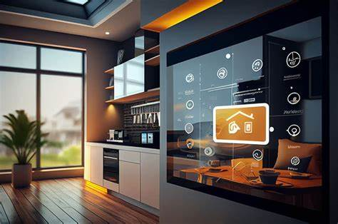

# Smart Home Automation System



## Overview

The **Smart Home Automation System** is a Python-based application designed to provide users with seamless control over their home appliances. By leveraging modern technologies, this system offers:

* **Device Management**: Easily add, remove, or modify devices within your smart home ecosystem.
* **Energy Tracking**: Monitor and analyze energy consumption patterns to optimize usage.
* **Automation**: Set up rules and schedules to automate device operations based on time, sensor inputs, or user preferences.

## Features

* **User-Friendly Interface**: Intuitive design ensures easy navigation and control.
* **Scalability**: Add multiple devices and sensors without compromising performance.
* **Real-Time Monitoring**: Get instant updates on device statuses and energy consumption.
* **Custom Automation Rules**: Define conditions and actions to automate tasks, enhancing convenience and efficiency.

## Installation

### Prerequisites

* Python 3.6 or higher
* pip (Python package installer)

### Steps

1. **Clone the Repository**:

   ```bash
   git clone https://github.com/hoorain17/Smart-Home-Automation-System.git
   cd Smart-Home-Automation-System
   ```

2. **Install Dependencies**:

   ```bash
   pip install -r requirements.txt
   ```

3. **Run the Application**:

   ```bash
   python Smart_Home_Automation_System.py
   ```

   Alternatively, you can explore the Jupyter Notebook version:

   ```bash
   jupyter notebook Smart_Home_Automation_System.ipynb
   ```

## Project Structure

* `Smart_Home_Automation_System.py`: Main application script.
* `Smart_Home_Automation_System.ipynb`: Jupyter Notebook version for interactive exploration.
* `requirements.txt`: Lists all Python dependencies.
* `automation.jpg`, `device_managment.jpg`, `energy_tracker.jpg`: Visual representations of the system's features.

## Usage

Upon launching the application:

1. **Device Management**: Navigate to the device management section to add or configure devices.
2. **Energy Tracking**: Access real-time energy consumption data and historical analytics.
3. **Automation**: Set up rules to automate device operations based on specific triggers or schedules.

## Contributing

Contributions are welcome! If you'd like to enhance the system or fix issues:

1. Fork the repository.
2. Create a new branch:

   ```bash
   git checkout -b feature/YourFeatureName
   ```
3. Commit your changes:

   ```bash
   git commit -m 'Add some feature'
   ```
4. Push to the branch:

   ```bash
   git push origin feature/YourFeatureName
   ```
5. Open a pull request.

## License

This project is open-source and available under the [MIT License](LICENSE).
